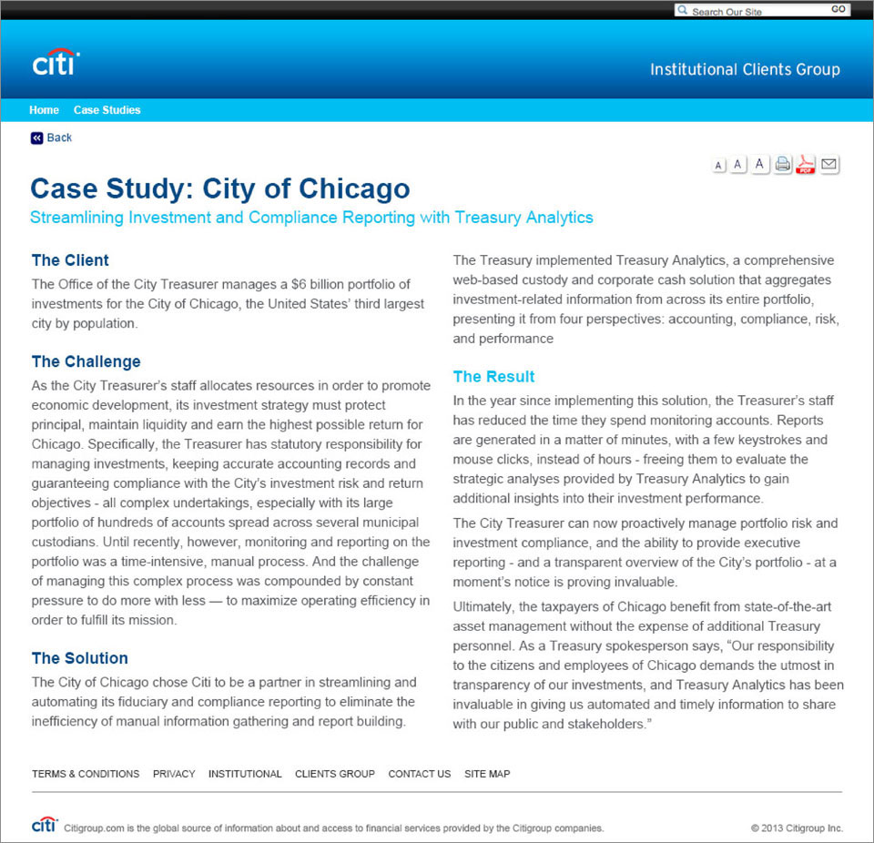

	

MY ROLE 
<ul style="font-family: adelle-sans; font-size: 13px; font-weight:500;">
<li style="font-family: adelle-sans; font-size: 13px; font-weight:500;">Visual design.</li>
</ul>
CHALLENGE
<ul style="font-family: adelle-sans; font-size: 13px; font-weight:500;">
<li style="font-family: adelle-sans; font-size: 13px; font-weight:500;">Adhere to Citi branding.</li>
</ul>
ANALYSIS
<ul style="font-family: adelle-sans; font-size: 13px; font-weight:500;">
<li style="font-family: adelle-sans; font-size: 13px; font-weight:500;"></li>
</ul>

 
<figure class="third">
     
     
     
</figure>