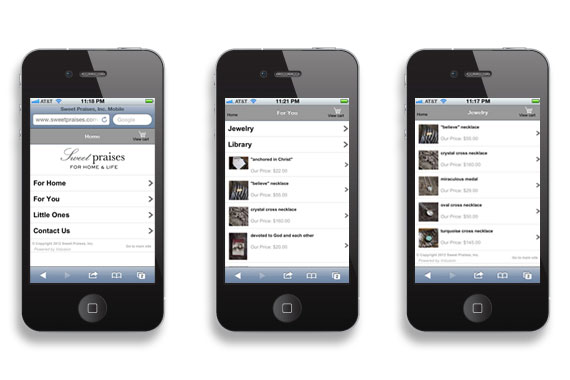
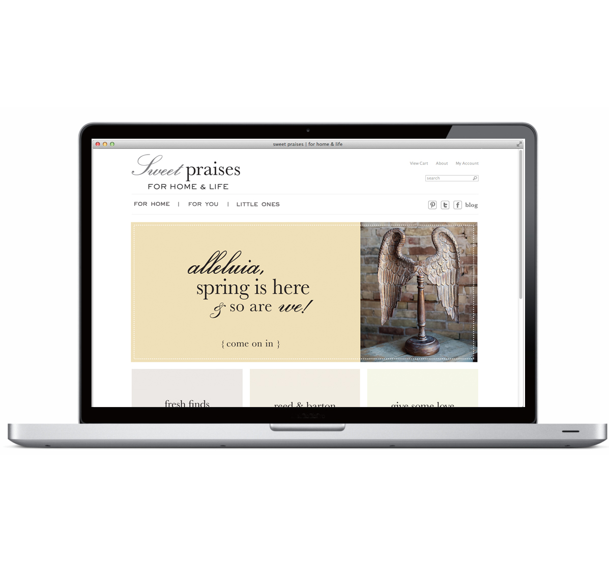
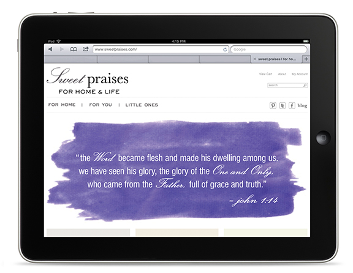
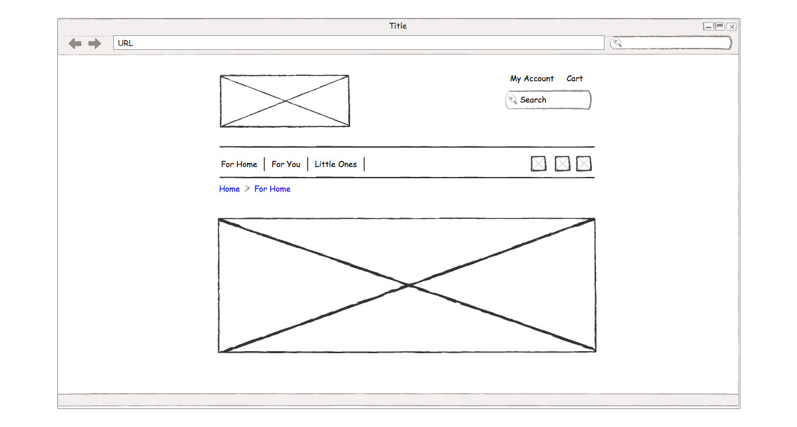
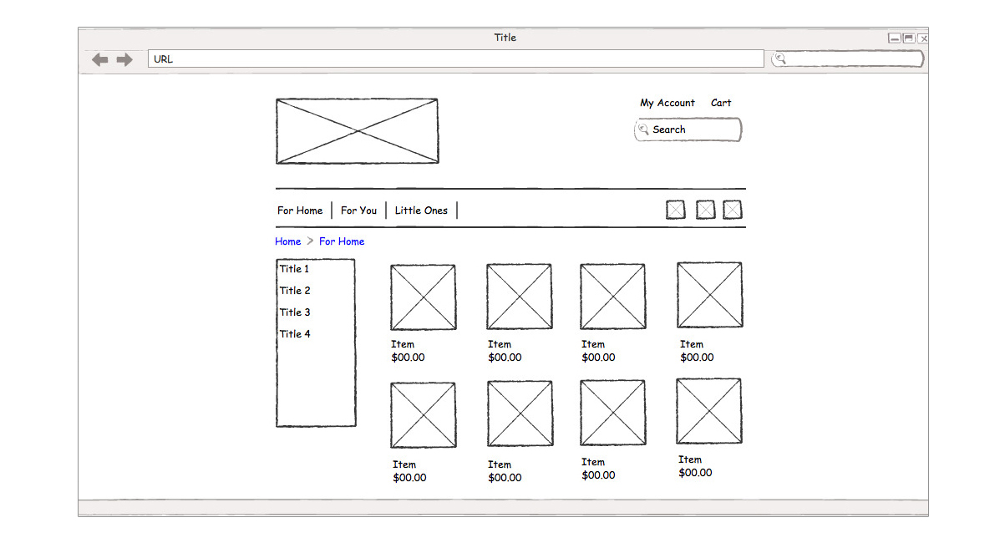

	

MY ROLE 
<ul style="font-family: adelle-sans; font-size: 13px; font-weight:500;">
<li style="font-family: adelle-sans; font-size: 13px; font-weight:500;">Visual design, front-end developer.</li>
</ul>
CHALLENGE
<ul style="font-family: adelle-sans; font-size: 13px; font-weight:500;">
<li style="font-family: adelle-sans; font-size: 13px; font-weight:500;">Setup an e-commerce site for small business.</li>
</ul>
ANALYSIS
<ul style="font-family: adelle-sans; font-size: 13px; font-weight:500;">
<li style="font-family: adelle-sans; font-size: 13px; font-weight:500;">Choose an apporpriate e-commerce solution.
</li>
</ul>

 
<figure class="half">
     
     
     
     
</figure>