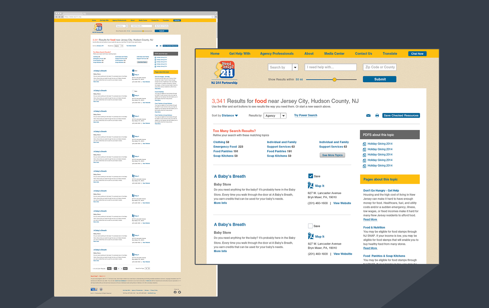

	
</a>

MY ROLE
Project Manager, User Experience, and Visual Designer

CHALLENGE
Develop a more user friendly search that returns results consisting of services and site content based off complex taxonomies.

Provide a CMS for NJ211 staff to edit/publish/archive content.

Integrate established technologies and new functionality.
               
SOLUTION

Designed a search that directs the user to use taxonomies to find the service they are looking for.

Wrote a product spec to identify all requirements for new site and the necessary solutions for them. As well as responsibilities of specific vendors.

Established process framework to keep all team members informed about which features are backlogged, in process, or in testing.

Documents
Process File
Product Spec

 
<figure>
     
</figure>
 

### hi-fi wireframes
<figure>
     
</figure>

### process
<figure class="half">
	
	
		
	

</figure>