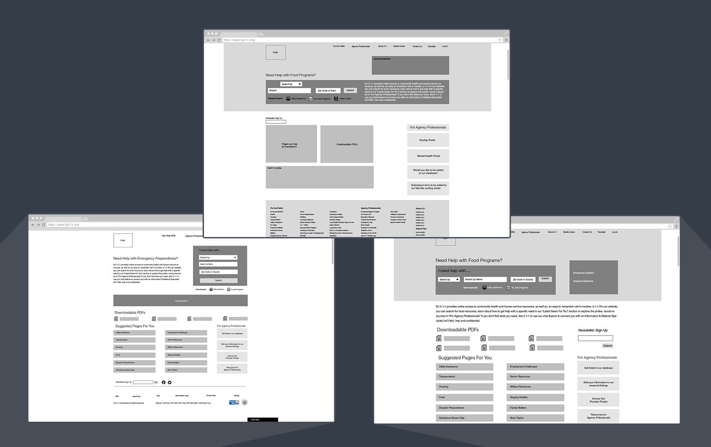
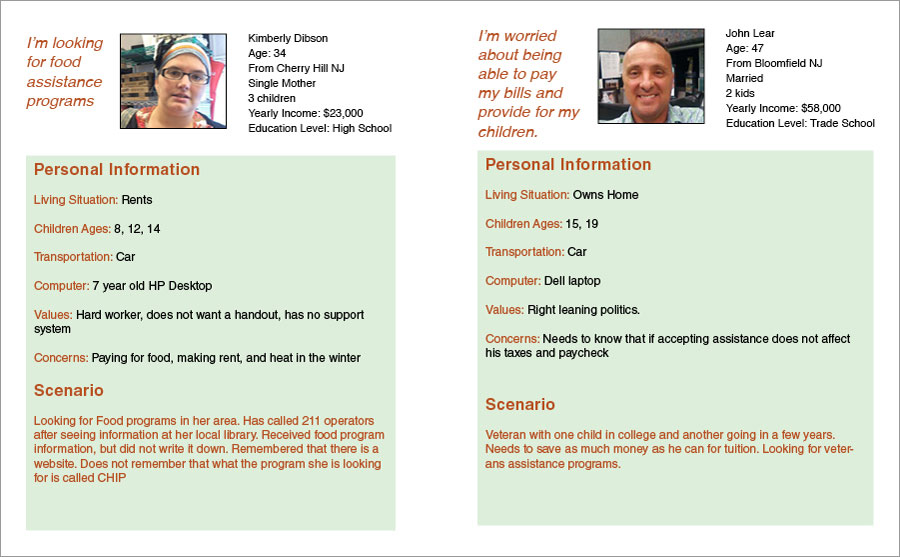
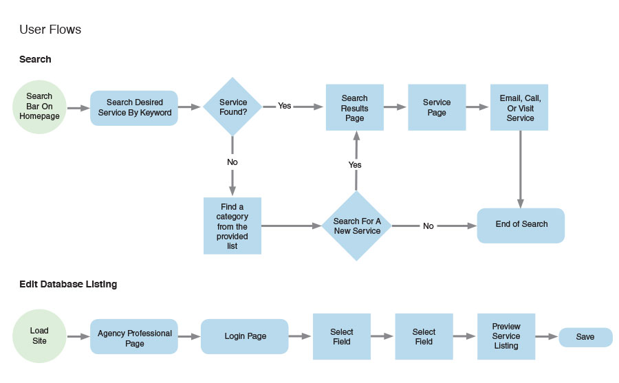

	
</a>

MY ROLE 
<ul style="font-family: adelle-sans; font-size: 13px; font-weight:500;">
<li style="font-family: adelle-sans; font-size: 13px; font-weight:500;">Project Manager, Wireframes, Userflow, and Visual Designer.</li>
</ul>

CHALLENGE
<ul style="font-family: adelle-sans; font-size: 13px; font-weight:500;">
<li style="font-family: adelle-sans; font-size: 13px; font-weight:500;">Develop a more user friendly search.</li>
<li style="font-family: adelle-sans; font-size: 13px; font-weight:500;">Provide a CMS for NJ211 staff to edit content.</li>
<li style="font-family: adelle-sans; font-size: 13px; font-weight:500;">Integrate established technologies with new functionality.</li>
</ul>
SOLUTION
<ul style="font-family: adelle-sans; font-size: 13px; font-weight:500;">
<li style="font-family: adelle-sans; font-size: 13px; font-weight:500;">Auto complete feature in search field.</li>
<li style="font-family: adelle-sans; font-size: 13px; font-weight:500;">Popular Search Suggestions.</li>
<li style="font-family: adelle-sans; font-size: 13px; font-weight:500;">Product Spec outlining new website.</li>
<li style="font-family: adelle-sans; font-size: 13px; font-weight:500;">Custom CMS with specific admin controls.</li>
</ul>
<a href="http://invis.io/CB2BZZ1YZ">Prototype</a>

 
<figure>
     
</figure>
 

### hi-fi wireframes
<figure>
     
</figure>

### process
<figure class="half">
	
	
		
	
</figure>
<a href="../../images/Product-Spec-NJ211-API-v7.pdf" style="font-family: adelle-sans; font-size: 13px; font-weight:500;text-decoration-style: dotted;" target="_blank">Download Product Spec</a> 
<a href="../../images/NJ211-Process-File.pdf" style="font-family: adelle-sans; font-size: 13px; font-weight:500;text-decoration-style: dotted;" target="_blank">Download the process file</a>