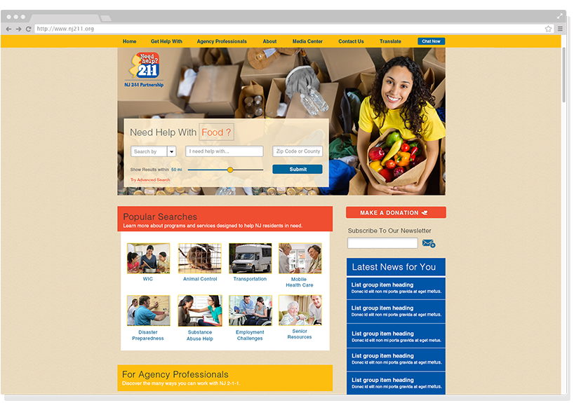

	
</a>

MY ROLE 
<ul style="font-family: adelle-sans; font-size: 13px; font-weight:500;">
<li style="font-family: adelle-sans; font-size: 13px; font-weight:500;">Project Manager, User Experience, and Visual Designer</li>
</ul>

CHALLENGE
<ul style="font-family: adelle-sans; font-size: 13px; font-weight:500;">
<li style="font-family: adelle-sans; font-size: 13px; font-weight:500;">Develop a more user friendly search.</li>
<li style="font-family: adelle-sans; font-size: 13px; font-weight:500;">Provide a CMS for NJ211 staff to edit/publish/archive content.</li>
<li style="font-family: adelle-sans; font-size: 13px; font-weight:500;">Integrate established technologies and new functionality.</li>
</ul>
SOLUTION
<ul style="font-family: adelle-sans; font-size: 13px; font-weight:500;">
<li style="font-family: adelle-sans; font-size: 13px; font-weight:500;">Designed a search that directs the user to use taxonomies to find the service they are looking for.</li>
<li style="font-family: adelle-sans; font-size: 13px; font-weight:500;">Wrote a product spec to identify all requirements for new site and the necessary solutions for them. As well as responsibilities of specific vendors.</li>
<li style="font-family: adelle-sans; font-size: 13px; font-weight:500;">Established process framework to keep all team members informed about which features are backlogged, in process, or in testing.</li>
</ul>

<a href="../../images/Product-Spec-NJ211-API-v7.pdf" style="font-family: adelle-sans; font-size: 13px; font-weight:500; text-decoration-style: dotted;" target="_blank">Download Product Spec</a>

 
<figure>
     
</figure>
 

### hi-fi wireframes
<figure>
     
</figure>

### process
<figure class="half">
	
	
		
	
</figure>
<a href="../../images/NJ211-Process-File.pdf" style="font-family: adelle-sans; font-size: 13px; font-weight:500;text-decoration-style: dotted;" target="_blank">Download the process file</a>