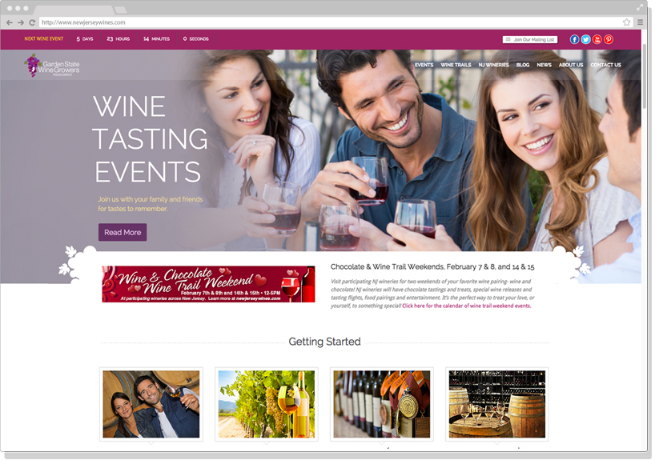
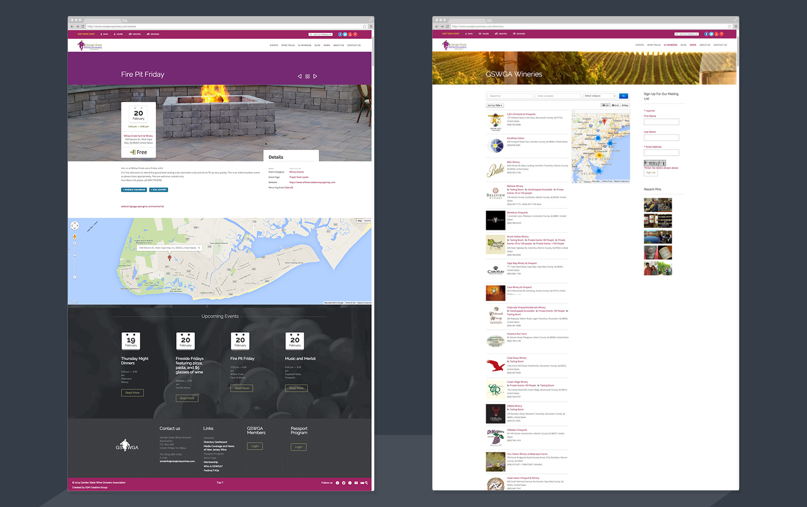

	

MY ROLE 
<ul style="font-family: adelle-sans; font-size: 13px; font-weight:500;">
<li style="font-family: adelle-sans; font-size: 13px; font-weight:500;">Personas, wiregrames, user flow, and post-mortem.</li>
</ul>
CHALLENGE
<ul style="font-family: adelle-sans; font-size: 13px; font-weight:500;">
<li style="font-family: adelle-sans; font-size: 13px; font-weight:500;">Recreate paper and stamp program in a mobile app.</li>
<li style="font-family: adelle-sans; font-size: 13px; font-weight:500;">Responsive website.</li>
<li style="font-family: adelle-sans; font-size: 13px; font-weight:500;">Winery admin area.</li>
</ul>
ANALYSIS
<ul style="font-family: adelle-sans; font-size: 13px; font-weight:500;">
<li style="font-family: adelle-sans; font-size: 13px; font-weight:500;">Different viewing options and categories for events.
</li>
<li style="font-family: adelle-sans; font-size: 13px; font-weight:500;">Site and features designed for different screen sizes.
</li>
<li style="font-family: adelle-sans; font-size: 13px; font-weight:500;">Main event area on homepage and event countdown.
</li>
<li style="font-family: adelle-sans; font-size: 13px; font-weight:500;">Wineries can add photos and update information.</li>
</ul>

 
<figure>
     
</figure>
 
<figure>
     
</figure>