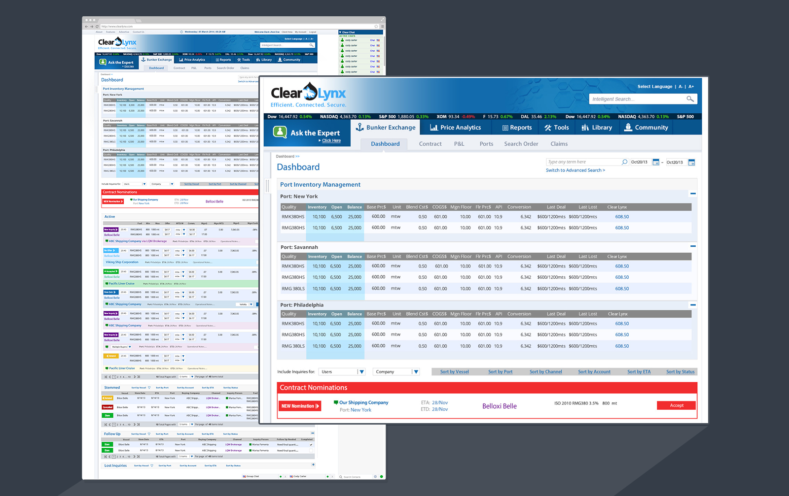
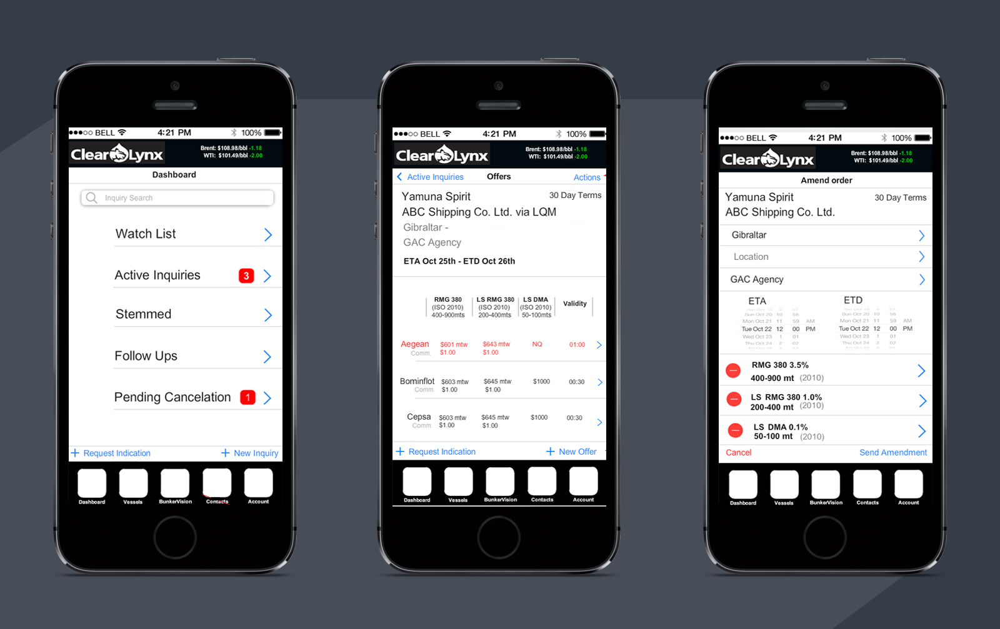

	

MY ROLE 
<ul style="font-family: adelle-sans; font-size: 13px; font-weight:500;">
<li style="font-family: adelle-sans; font-size: 13px; font-weight:500;">Project Manager</li>
</ul>
CHALLENGE
<ul style="font-family: adelle-sans; font-size: 13px; font-weight:500;">
<li style="font-family: adelle-sans; font-size: 13px; font-weight:500;">Large amount of tabular data.</li>
<li style="font-family: adelle-sans; font-size: 13px; font-weight:500;">Integrate chat feature.</li>
<li style="font-family: adelle-sans; font-size: 13px; font-weight:500;">Three different user behaviors.</li>
</ul>
SOLUTION
<ul style="font-family: adelle-sans; font-size: 13px; font-weight:500;">
<li style="font-family: adelle-sans; font-size: 13px; font-weight:500;">Identify the different actions and data that is unique to each user.</li>
<li style="font-family: adelle-sans; font-size: 13px; font-weight:500;">Identify different types of tabular data and create a color system to differentiate.</li>
<li style="font-family: adelle-sans; font-size: 13px; font-weight:500;">Chat feature occupies the right margin.</li>
</ul>

 
<figure>
     
</figure>
<figure>
     
</figure>
 

<a href="http://app.mockflow.com/view/c3eb80852208c8ffda771ddf112f0cc1" target="_blank">Desktop Protoype</a>
<a href="http://app.mockflow.com/view/09E905A55F0DE44F910699CF256C1C48" target="_blank">Mobile Protoype</a>