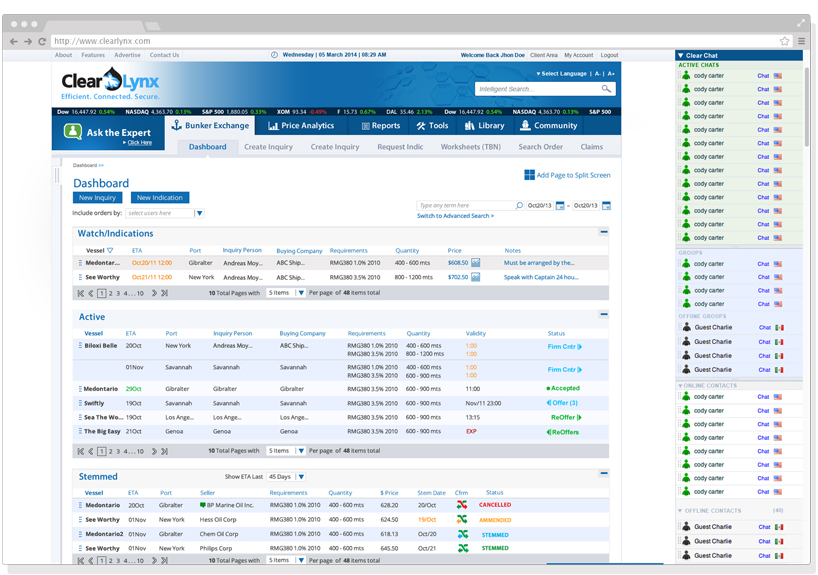
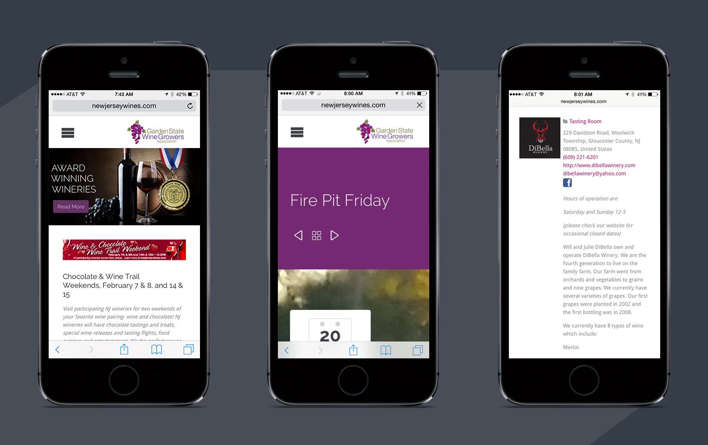
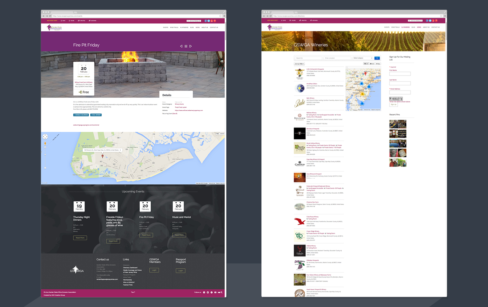

	

MY ROLE 
<ul style="font-family: adelle-sans; font-size: 13px; font-weight:500;">
<li style="font-family: adelle-sans; font-size: 13px; font-weight:500;">Project Manager, Front-End Developer</li>
</ul>
CHALLENGE
<ul style="font-family: adelle-sans; font-size: 13px; font-weight:500;">
<li style="font-family: adelle-sans; font-size: 13px; font-weight:500;">Produce a resonsive website.
</li>
<li style="font-family: adelle-sans; font-size: 13px; font-weight:500;">Create a portal for all events.</li>
<li style="font-family: adelle-sans; font-size: 13px; font-weight:500;">Site must convert visitors to attendees at events.
</li>
<li style="font-family: adelle-sans; font-size: 13px; font-weight:500;">Be a directory for all member wineries.
</li>
<li style="font-family: adelle-sans; font-size: 13px; font-weight:500;">Share winery activities with friends.</li>
</ul>
SOLUTION
<ul style="font-family: adelle-sans; font-size: 13px; font-weight:500;">
<li style="font-family: adelle-sans; font-size: 13px; font-weight:500;">Site and features designed for different screen sizes.
</li>
<li style="font-family: adelle-sans; font-size: 13px; font-weight:500;">User access for wineries to update their profile page.
</li>
<li style="font-family: adelle-sans; font-size: 13px; font-weight:500;">Simple shareability links.</li>
<li style="font-family: adelle-sans; font-size: 13px; font-weight:500;">Different viewing options and categories for events.</li>
</ul>

 
<figure>
     
</figure>
<figure>
     
</figure>