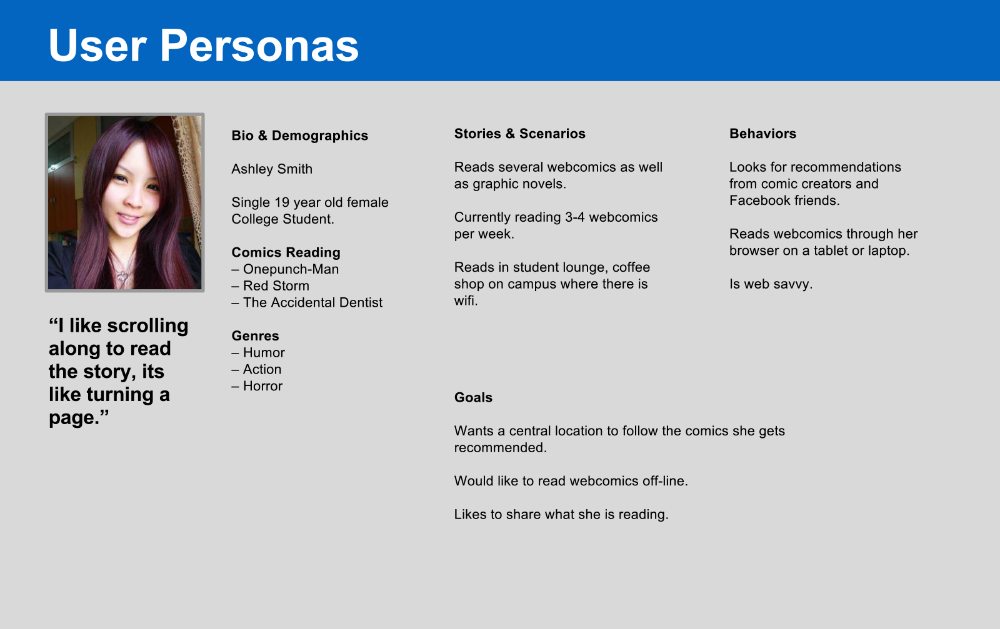

	
<iframe src="//player.vimeo.com/video/119753957" width="500" height="313" frameborder="0" webkitallowfullscreen mozallowfullscreen allowfullscreen></iframe>

I developed this app while taking the product management course at General Assembly NY. I learned product of market fit, roadvmapping, and pitching to investors.

Kapower! is a webcomics aggregator based app. Webcomics are posted on various sites all over the internet, but there is no app or site that really helps readers find what they like. There are apps that have all the webcomics catalogued, but the process to find what you like is very manual and involves a lot of steps. With Kapower! I hope to solve this discovery problem for webcomic fans by recommending similar content based of what they like to read. I in-vision a simple editor based recommendation systems which matches users to content. The app matches the user to content based off a series of questions during the on boarding process.

 
<figure>
     
</figure>
<figure>
     
</figure>
<figure>
     
</figure>