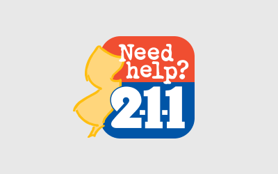

<h2>Work</h2>

   
  <h2 class="post-title" itemprop="name"><a href="portfolio/NJ211">Sample Post Style Guide</a></h2>
  
Below is just about everything you’ll need to style in the theme. Check the source code to see the many embedded elements within paragraphs.

<!-- /.tile -->

  
  <h2 class="post-title" itemprop="name"><a href="portfolio/GSWGA">newjerseywines.com</a></h2>
  
Designed to put the focus on you and your writing. Headers, navigation, sidebars, and footers have been purposely deemphasized.

<!-- /.tile -->

  <h2 class="post-title">Customizable</h2>
  
Packed with layouts and modules. Include Disqus comments, social sharing buttons, and table of contents on one or all pages.

<!-- /.tile -->

  <h2 class="post-title">Extensible</h2>
  
Compatible with popular libraries like <a href="http://bourbon.io">Bourbon</a>, <a href="http://neat.bourbon.io/">Neat</a>, and <a href="http://github.com/octopress/octopress">Octopress</a> to help build and deploy your site with ease.

<!-- /.tile -->

<!-- /.tiles -->
